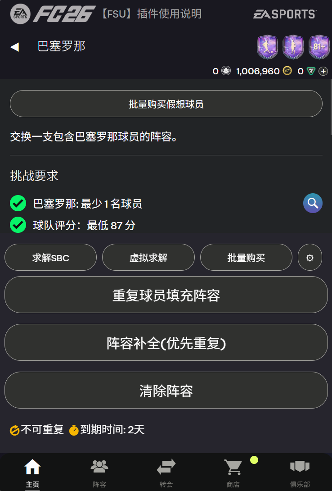
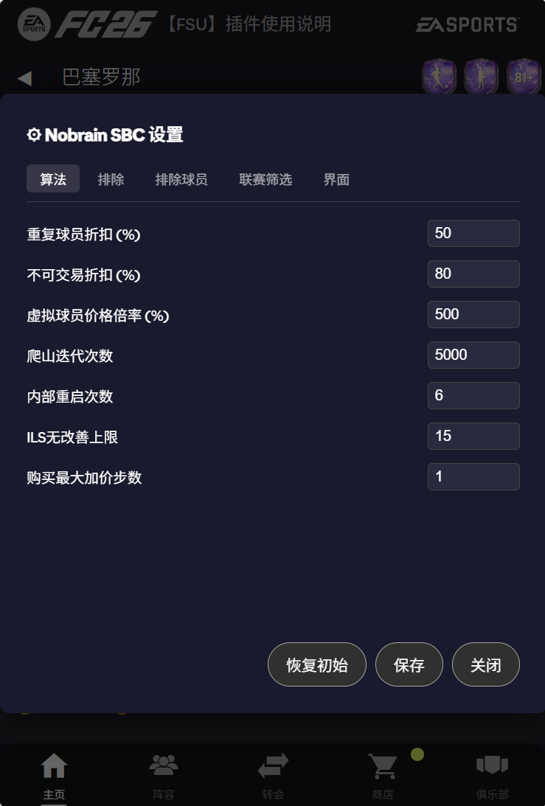

# NoBrain SBC - EA Sports FC SBC Solver

[中文](#中文) | [English](#english)

---

## 中文

### 简介

NoBrain SBC 是一个 Tampermonkey 用户脚本，用于在 EA Sports FC FUT 网页应用中自动求解 SBC（球员挑战赛）。完全在客户端运行，无需后端服务。

**本项目的算法设计和代码实现均由 AI 完成。**

### 主要功能

- **离线求解**：使用贪心 + 局部搜索算法自动求解 SBC
- **虚拟球员支持**：可以使用 FSU 插件填充虚拟球员，然后优化阵容
- **实时取价**：从 fut.gg 获取球员市场价格
- **批量购买**：一键购买阵容中的虚拟球员
- **价格显示**：在球员卡片上显示市场价格，标注 SBC/OBJ/SP 球员
- **珍贵球员警示**：红色标注高价值球员，避免误用
- **联赛筛选**：设置特定联赛球员的价格系数，优先使用其他联赛球员
- **排除球员**：锁定特定球员不参与求解
- **多语言支持**：自动检测系统语言，支持中文/英文

### 安装

1. 安装 [Tampermonkey](https://www.tampermonkey.net/) 浏览器扩展
2. 点击 [安装脚本](https://github.com/harveyhu2012/nobrain-sbc/raw/main/tampermonkey-nobrain-sbc.user.js)
3. 打开 [EA Sports FC FUT 网页应用](https://www.ea.com/ea-sports-fc/ultimate-team/web-app/)

### 使用方法

进入任意 SBC 挑战页面后，有两种使用方式：

#### 方式一：直接求解（使用俱乐部球员）

1. 点击"求解 SBC"按钮
2. 脚本会使用你俱乐部中的球员自动求解
3. 求解完成后点击"提交"完成 SBC

#### 方式二：虚拟求解（推荐，配合 FSU 使用）

1. 安装 [FSU (FUT Web 增强器)](https://greasyfork.org/zh-CN/scripts/431044-fsu-eafc-fut-web-%E5%A2%9E%E5%BC%BA%E5%99%A8)
2. 点击"虚拟求解"按钮（会自动调用 FSU 的模板填充功能）
3. 脚本会尽量用俱乐部球员替代虚拟球员
4. 点击"批量购买"购买剩余的虚拟球员
5. 最终获得可提交的完整阵容

#### 排除球员

在球员详细信息界面勾选"SBC 锁定"，该球员将不会被用于求解 SBC。

#### 查询市场价格

- 在球员基本信息界面点击"查询市场低价"获取单个球员的市场价格
- 在 SBC 阵容界面点击"实时取价"获取整个阵容的市场低价

### 设置

点击"设置"按钮可以配置：
- 算法参数（爬山迭代次数、ILS 上限等）
- 价格缓存时间
- 购买最大加价步数
- 联赛筛选规则
- 排除球员列表

### 注意事项

- 脚本依赖 FUT 网页应用的内部 API，EA 更新后可能失效
- 求解结果不保证是最优解，但通常能找到可行且费用较低的方案
- 批量购买功能会自动购买球员，请谨慎使用
- 获取球员价格依赖 fut.gg 和 futnext.com，可能因访问频繁或地区限制而被限流

### 参考

1. kcka - [【FSU】EAFC FUT WEB 增强器](https://greasyfork.org/zh-CN/scripts/431044-fsu-eafc-fut-web-%E5%A2%9E%E5%BC%BA%E5%99%A8)
2. titiroMonkey - [Auto-SBC](https://github.com/titiroMonkey/Auto-SBC)

### 开源协议

MIT License

---

## English

### Introduction

NoBrain SBC is a Tampermonkey userscript that automatically solves SBC (Squad Building Challenges) in EA Sports FC FUT Web App. It runs entirely on the client side without requiring a backend service.

**Both the algorithm design and code implementation of this project were completed by AI.**

### Key Features

- **Offline Solver**: Automatically solves SBC using greedy + local search algorithm
- **Concept Player Support**: Works with FSU plugin to optimize squads with concept players
- **Live Pricing**: Fetches player market prices from fut.gg
- **Batch Purchase**: Buy all concept players in the squad with one click
- **Price Display**: Shows market prices on player cards, marks SBC/OBJ/SP players
- **Precious Player Warning**: Red labels for high-value players to avoid accidental use
- **League Filter**: Set price multipliers for specific leagues to prioritize others
- **Exclude Players**: Lock specific players from being used in solutions
- **Multi-language**: Auto-detects system language, supports Chinese/English

### Installation

1. Install [Tampermonkey](https://www.tampermonkey.net/) browser extension
2. Click [Install Script](https://github.com/harveyhu2012/nobrain-sbc/raw/main/tampermonkey-nobrain-sbc.user.js)
3. Open [EA Sports FC FUT Web App](https://www.ea.com/ea-sports-fc/ultimate-team/web-app/)

### Usage

After navigating to any SBC challenge page, there are two ways to use the script:

#### Method 1: Direct Solve (Using Club Players)

1. Click "Solve SBC" button
2. The script will automatically solve using players from your club
3. Click "Submit" to complete the SBC after solving

#### Method 2: Virtual Solve (Recommended, with FSU)

1. Install [FSU (FUT Web Enhancer)](https://greasyfork.org/zh-CN/scripts/431044-fsu-eafc-fut-web-%E5%A2%9E%E5%BC%BA%E5%99%A8)
2. Click "Virtual Solve" button (automatically calls FSU's template fill function)
3. The script will replace concept players with club players as much as possible
4. Click "Buy Squad" to purchase remaining concept players
5. Get a complete squad ready for submission

#### Exclude Players

Check "SBC Lock" in the player details view to exclude that player from being used in SBC solutions.

#### Check Market Prices

- Click "Get Market Price" in the player details view to fetch the market price for a single player
- Click "Live Price" in the SBC squad view to fetch market prices for the entire squad

### Settings

Click "Settings" button to configure:
- Algorithm parameters (hill climb iterations, ILS limit, etc.)
- Price cache duration
- Max price increment steps for purchases
- League filter rules
- Excluded players list

### Notes

- The script relies on FUT Web App's internal APIs, which may break after EA updates
- Solutions are not guaranteed to be optimal, but usually feasible with low cost
- Batch purchase feature automatically buys players, use with caution
- Price fetching depends on fut.gg and futnext.com, which may be rate-limited due to frequent access or regional restrictions

### References

1. kcka - [【FSU】EAFC FUT WEB 增强器](https://greasyfork.org/zh-CN/scripts/431044-fsu-eafc-fut-web-%E5%A2%9E%E5%BC%BA%E5%99%A8)
2. titiroMonkey - [Auto-SBC](https://github.com/titiroMonkey/Auto-SBC)

### License

MIT License
